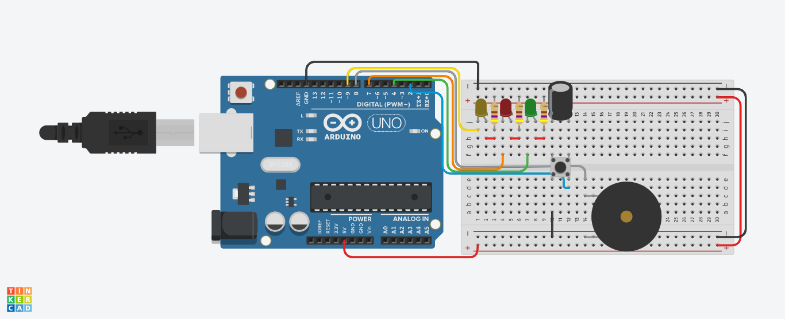

# Pomodoro Timer Arduino

A DIY Arduino based Pomodoro timer using low power mode.

## Elements

- 3 LED
- 3 470 Ω Resistor
- 1 Piezo buzzer
- 1 Push Button
- 1 0.33μF Capacitor
- 1 Arduino Uno

## How it works

The Pomodoro Timer has a push button to comands and 3 states:

1. Waiting for a comand.
2. Working for approximately 25 min.
3. Resting for approximately 5 min.

### Human interface

Each state is represented by a led. Every time that the Pomodoro Timer backing to state 1, the piezo buzzer is activated for while.

### States transitions

Initially, the Pomodoro Timer is set to state 1 and a press in the push button changes him to state 2.

In state 1, the Pomodoro Timer is waiting the user to press the button. When the button is pressed the Pomodoro Timer change his state to state 2 if the state before was state 3 or state 3 if the state before was state 2.

After the time has passed, the Pomodoro Timer is set back to state 1.

The Pomodoro Timer states trasitions can be seen bellow:

`loop {1. -> 2. -> 1. -> 3.}` 

If the push button is pressed during state 2 or state 3, the Pomodoro Timer is reseted.

## Where is the `lower power` mode?

During to all states,the microcontroller is set to sleep. In state 1 the microcontroller is only waked if the push button is pressed. In state 2 and 3, the microcontroller wake every 8 seconds to contabilize the pasted time. 

This is not perfect, but due to the limitations of ATMEGA328p this is what could be done. :)

## How to build.

This project uses [PlatformIO](https://platformio.org/). But you can compile the project using any compiler compatible with Arduino.

### Using others compilers
The main function is [`src/main.cpp`](src/main.cpp) folder.

All configuration of the Pomodoro Timer that you need to set is in [`include/configs.h`](include/configs.h).

You will need to link [Low Power](https://github.com/rocketscream/Low-Power) library and [Arduino](https://github.com/arduino/ArduinoCore-avr) library.

You also need to link all libraries in [`include/`](include/) and [`lib/`](include/).

## License

See [LICENSE](LICENSE)

